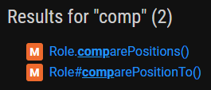
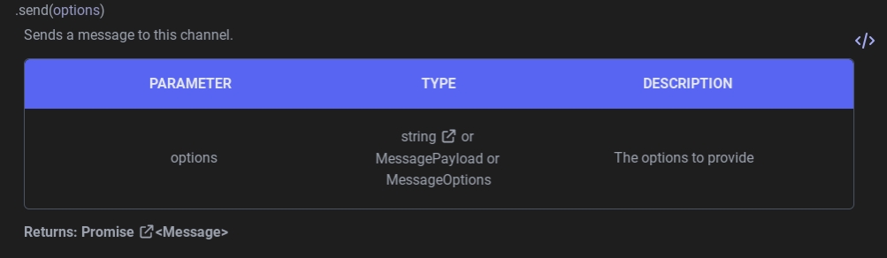

Throughout the discord.js docs and when asking for help on the official server, you will run into many different kinds of notations. To help you understand the texts that you read, we will be going over some standard notations.

<Callout>
	Always keep in mind that notation is not always rigorous. There will be typos, misunderstandings, or contexts that
	will cause notation to differ from the usual meanings.
</Callout>

## Classes

Some common notations refer to a class or the properties, methods, or events of a class. There are many variations on these notations, and they are very flexible depending on the person, so use your best judgment when reading them.

The notation `<Class>` means an instance of the `Class` class. For example, a snippet like `<BaseInteraction>.reply('Hello')` is asking you to replace `<BaseInteraction>` with some value that is an instance of `BaseInteraction`, e.g. `interaction.reply('Hello')`. It could also just be a placeholder, e.g., `<id>` would mean a placeholder for some ID.

The notation `Class#foo` can refer to the `foo` property, method, or event of the `Class` class. Which one the writer meant needs to be determined from context. For example:

- `BaseInteraction#user` means that you should refer to the `user` property on a `BaseInteraction`.
- `TextChannel#send` means that you should refer to the `send` method on a `TextChannel`.
- `Client#interactionCreate` means that you should refer to the `interactionCreate` event on a `Client`.

<Callout>
	Remember that this notation is not valid JavaScript; it is a shorthand to refer to a specific piece of code.
</Callout>

Sometimes, the notation is extended, which can help you determine which one the writer meant. For example, `TextChannel#send(options)` is definitely a method of `TextChannel`, since it uses function notation. `Client#event:messageCreate` is an event since it says it is an event.

The vital thing to take away from this notation is that the `#` symbol signifies that the property, method, or event can only be accessed through an instance of the class. Unfortunately, many abuse this notation, e.g., `<Message>#send` or `Util#resolveColor`. `<Message>` is already an instance, so this makes no sense, and `resolveColor` is a static method–you should write it as `Util.resolveColor`. Always refer back to the docs if you are confused.

As an example, the documentation's search feature uses this notation.

Notice the use of the `.` operator for the static method, `Role.comparePositions` and the `#` notation for the method, `Role#comparePositionsTo`.

## Types

In the discord.js docs, there are type signatures everywhere, such as in properties, parameters, or return values. If you do not come from a statically typed language, you may not know what specific notations mean.

The symbol `*` means any type. For example, methods that return `*` mean that they can return anything, and a parameter of type `*` can be anything.

The symbol `?` means that the type is nullable. You can see it before or after the type (e.g. `?T` or `T?`). This symbol means that the value can be of the type `T` or `null`. An example is `GuildMember#nickname`; its type is `?string` since a member may or may not have a nickname.

The expression `T[]` means an array of `T`. You can sometimes see multiple brackets `[]`, indicating that the array is multi-dimensional, e.g., `string[][]`.

The expression `...T` signifies a rest parameter of type `T`. This means that the function can take any amount of arguments, and all those arguments must be of the type `T`.

The operator `|`, which can read as "or", creates a union type, e.g. `A|B|C`. Simply, it means the value can be of any one of the types given.

The angle brackets `<>` are used for generic types or parameterized types, signifying a type that uses another type(s). The notation looks like `A<B>` where `A` is the type and `B` is a type parameter. If this is hard to follow, it is enough to keep in mind that whenever you see `A<B>`, you can think of an `A` containing `B`. Examples:

- `Array<String>` means an array of strings.
- `Promise<User>` means a `Promise` that contains a `User`.
- `Array<Promise<User|GuildMember>>` would be an array of `Promise`s, each containing a `User` or a `GuildMember`.
- `Collection<Snowflake, User>` would be a `Collection`, containing key-value pairs where the keys are `Snowflake`s, and the values are `User`s.

In this piece of the docs, you can see two type signatures, `string`, `MessagePayload`, or `MessageOptions`, and `Promise<(Message|Array<Message>)>`. The meaning of the word "or" here is the same as `|`.
