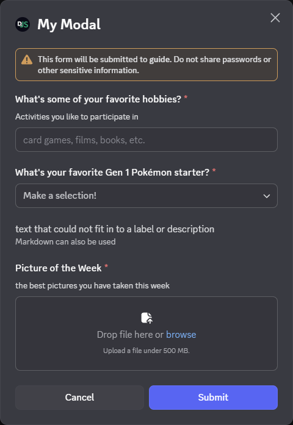

With modals you can create pop-up forms that allow users to provide you with formatted inputs through submissions. We'll cover how to create, show, and receive modals using discord.js!

<Callout>
	This page is a follow-up to the [interactions (slash commands) page](../slash-commands/advanced-creation). Please
	carefully read that section first, so that you can understand the methods used in this section.
</Callout>

## Building and responding with modals

Unlike message components, modals aren't strictly components themselves. They're a callback structure used to respond to interactions.

<Callout>
	You can have a maximum of five `Label` or `Text Display` components per modal. Similarly a `Label` may only contain
	one component.
</Callout>

To create a modal you construct a new `ModalBuilder`. You can then use the setters to add the custom id and title.

```js
const { Events, ModalBuilder } = require('discord.js');

client.on(Events.InteractionCreate, async (interaction) => {
	if (!interaction.isChatInputCommand()) return;
	if (interaction.commandName === 'ping') {
		const modal = new ModalBuilder().setCustomId('myModal').setTitle('My Modal');

		// TODO: Add components to modal...
	}
});
```

<Callout>
	The `customId` is a developer-defined string of up to 100 characters. Use this field to uniquely identify of an
	incoming interactions from your modals.
</Callout>

The next step is to add components to the `modalBuilder`. These modal components are used to create the form of the modal.

### Label

Label components are used to add a label and description to interactive modal components.(text input, select menus, etc.)

```js
const { LabelBuilder, ModalBuilder } = require('discord.js');

client.on(Events.InteractionCreate, async (interaction) => {
	if (!interaction.isChatInputCommand()) return;
	if (interaction.commandName === 'ping') {
		// Create the modal
		const modal = new ModalBuilder().setCustomId('myModal').setTitle('My Modal');

		// [!code focus:12]
		// TODO: Add interactive components

		// [!code ++:5]
		const hobbiesLabel = new LabelBuilder()
			// The Label is large text identifying the interactive component to the user
			.setLabel("What's some of your favorite hobbies?")
			// The description is optional small text under the label and above the interactive component
			.setDescription('Activities you like to participate in');

		// TODO: Add components to modal...

		// [!code ++:2]
		// Add label to modal
		modal.addLabelComponents(hobbiesLabel);

		// TODO: Respond with modal...
	}
});
```

<Callout type="warn">
	`label` can be a max length of 45 characters `description` can be a max length of 100 characters
</Callout>

### Text Input

Text input is an interactive component used to accept free-form text.

```js
const { LabelBuilder, ModalBuilder, TextInputBuilder, TextInputStyle } = require('discord.js');

client.on(Events.InteractionCreate, async (interaction) => {
	if (!interaction.isChatInputCommand()) return;
	if (interaction.commandName === 'ping') {
		// Create the modal
		const modal = new ModalBuilder().setCustomId('myModal').setTitle('My Modal');

		// [!code focus:6]
		// [!code ++:6]
		const hobbiesInput = new TextInputBuilder()
			.setCustomId('hobbiesInput')
			// Paragraph means multiple lines of text.
			.setStyle(TextInputStyle.Paragraph)
			// Uninteractable text inside of the text input
			.setPlaceholder('card games, films, books, etc.');

		// TODO: Add additional interactive components

		// [!code focus:8]
		const hobbiesLabel = new LabelBuilder()
			// The Label is large text identifying the interactive component to the user
			.setLabel("What's some of your favorite hobbies?")
			// The description is optional small text under the label and above the interactive component
			.setDescription('Activities you like to participate in')
			// [!code ++:2]
			// set text input component of label
			.setTextInputComponent(hobbiesInput);

		// TODO: Add components to modal...

		// Add label to modal
		modal.addLabelComponents(hobbiesLabel);

		// TODO: Respond with modal...
	}
});
```

#### Input styles

Currently there are two different input styles available:

- `Short`, a single-line text entry
- `Paragraph`, a multi-line text entry

#### Input properties

In addition to the `customId` and `style`, a text input can be customized in a number of ways to apply validation, prompt the user, or set default values via the `TextInputBuilder` methods:

```js
const input = new TextInputBuilder()
	// set the component id (this is not the custom id)
	.setId(0)
	// Set the maximum number of characters to allowed
	.setMaxLength(1_000)
	// Set the minimum number of characters required for submission
	.setMinLength(10)
	// Set a default value to pre-fill the text input
	.setValue('Default')
	// Require a value in this text input field (defaults to true)
	.setRequired(true);
```

### Select Menu

Select menu is an interactive component that allows you to limit user inputs to a preselected list of values

In addition to string select menus, menus for users, roles, mentionables(user and roles), and channels can be used in modals

<Callout>
	For more information on the configuration of [select menus](../interactive-components/select-menus) see the
	interaction page
</Callout>

```js
const {
	StringSelectMenuBuilder,
	StringSelectMenuOptionBuilder,
	LabelBuilder,
	ModalBuilder,
	TextInputBuilder,
	TextInputStyle,
} = require('discord.js');

client.on(Events.InteractionCreate, async (interaction) => {
	if (!interaction.isChatInputCommand()) return;
	if (interaction.commandName === 'ping') {
		// Create the modal
		const modal = new ModalBuilder().setCustomId('myModal').setTitle('My Modal');

		const hobbiesInput = new TextInputBuilder()
			.setCustomId('hobbiesInput')
			// Paragraph means multiple lines of text.
			.setStyle(TextInputStyle.Paragraph)
			// Uninteractable text inside of the text input
			.setPlaceholder('card games, films, books, etc.');

		// [!code focus:24]
		// [!code ++:24]
		const favoriteStarterSelect = new StringSelectMenuBuilder()
			.setCustomId('starter')
			.setPlaceholder('Make a selection!')
			// Modal only property on select menus to prevent submission, defaults to true
			.setRequired(true)
			.addOptions(
				// String select menu options
				new StringSelectMenuOptionBuilder()
					// Label displayed to user
					.setLabel('Bulbasaur')
					// Description of option
					.setDescription('The dual-type Grass/Poison Seed Pokémon.')
					// Value returned to in modal submission
					.setValue('bulbasaur'),
				new StringSelectMenuOptionBuilder()
					.setLabel('Charmander')
					.setDescription('The Fire-type Lizard Pokémon.')
					.setValue('charmander'),
				new StringSelectMenuOptionBuilder()
					.setLabel('Squirtle')
					.setDescription('The Water-type Tiny Turtle Pokémon.')
					.setValue('squirtle'),
			);

		const hobbiesLabel = new LabelBuilder()
			// The Label is large text identifying the interactive component to the user
			.setLabel("What's some of your favorite hobbies?")
			// The description is optional small text under the label and above the interactive component
			.setDescription('Activities you like to participate in')
			// set text input component of label
			.setTextInputComponent(hobbiesInput);

		// [!code focus:4]
		// [!code ++:4]
		const favoriteStarterLabel = new LabelBuilder()
			.setLabel("What's your favorite Gen 1 Pokémon starter?")
			// The Description is small text under the label above the interactive component
			.setStringSelectMenuComponent(favoriteStarterSelect);

		// TODO: Add components to modal...

		// [!code focus:3]
		// Add label to modal
		modal.addLabelComponents(hobbiesLabel); // [!code --]
		modal.addLabelComponents(hobbiesLabel, favoriteStarterLabel); // [!code ++]

		// TODO: Respond with modal...
	}
});
```

### Text Display

Text display components are used to display text to the user witch does not fit in Labels or other interactive components

```js
const {
	StringSelectMenuBuilder,
	StringSelectMenuOptionBuilder,
	LabelBuilder,
	ModalBuilder,
	TextInputBuilder,
	TextInputStyle,
} = require('discord.js');

client.on(Events.InteractionCreate, async (interaction) => {
	if (!interaction.isChatInputCommand()) return;
	if (interaction.commandName === 'ping') {
		// Create the modal
		const modal = new ModalBuilder().setCustomId('myModal').setTitle('My Modal');

		const hobbiesInput = new TextInputBuilder()
			.setCustomId('hobbiesInput')
			// Paragraph means multiple lines of text.
			.setStyle(TextInputStyle.Paragraph)
			// Uninteractable text inside of the text input
			.setPlaceholder('card games, films, books, etc.');

		const favoriteStarterSelect = new StringSelectMenuBuilder()
			.setCustomId('starter')
			.setPlaceholder('Make a selection!')
			// Modal only property on select menus to prevent submission, defaults to true
			.setRequired(true)
			.addOptions(
				// String select menu options
				new StringSelectMenuOptionBuilder()
					// Label displayed to user
					.setLabel('Bulbasaur')
					// Description of option
					.setDescription('The dual-type Grass/Poison Seed Pokémon.')
					// Value returned to in modal submission
					.setValue('bulbasaur'),
				new StringSelectMenuOptionBuilder()
					.setLabel('Charmander')
					.setDescription('The Fire-type Lizard Pokémon.')
					.setValue('charmander'),
				new StringSelectMenuOptionBuilder()
					.setLabel('Squirtle')
					.setDescription('The Water-type Tiny Turtle Pokémon.')
					.setValue('squirtle'),
			);

		const hobbiesLabel = new LabelBuilder()
			// The Label is large text identifying the interactive component to the user
			.setLabel("What's some of your favorite hobbies?")
			// The description is optional small text under the label and above the interactive component
			.setDescription('Activities you like to participate in')
			// set text input component of label
			.setTextInputComponent(hobbiesInput);

		const favoriteStarterLabel = new LabelBuilder()
			.setLabel("What's your favorite Gen 1 Pokémon starter?")
			// The Description is small text under the label above the interactive component
			.setStringSelectMenuComponent(favoriteStarterSelect);

		// [!code focus:6]
		// [!code ++:2]
		const beeFact = new TextDisplayBuilder().setContent(
			"## Important Information\nAccording to all known laws of aviation, there is no way a bee should be able to fly. Its wings are too small to get its fat little body off the ground. The bee, of course, flies anyway because bees don't care what humans think is impossible.",
		);

		// Add label to modal
		modal
			.addLabelComponents(hobbiesLabel, favoriteStarterLabel)
			// [!code ++:1]
			.addTextDisplayComponents(beeFact);

		// TODO: Respond with modal...
	}
});
```

### Responding with modal

With the modal built call `ChatInputCommandInteraction#showModal` to display the modal to the user.

<Callout type="warn">
	Showing a modal must be the first response to an interaction. You cannot `deferReply()` or `deferUpdate()` then show a
	modal later.
</Callout>

```js
const {
	StringSelectMenuBuilder,
	StringSelectMenuOptionBuilder,
	LabelBuilder,
	ModalBuilder,
	TextInputBuilder,
	TextInputStyle,
} = require('discord.js');

client.on(Events.InteractionCreate, async (interaction) => {
	if (!interaction.isChatInputCommand()) return;
	if (interaction.commandName === 'ping') {
		// Create the modal
		const modal = new ModalBuilder().setCustomId('myModal').setTitle('My Modal');

		const hobbiesInput = new TextInputBuilder()
			.setCustomId('hobbiesInput')
			// Paragraph means multiple lines of text.
			.setStyle(TextInputStyle.Paragraph)
			// Uninteractable text inside of the text input
			.setPlaceholder('card games, films, books, etc.');

		const favoriteStarterSelect = new StringSelectMenuBuilder()
			.setCustomId('starter')
			.setPlaceholder('Make a selection!')
			// Modal only property on select menus to prevent submission, defaults to true
			.setRequired(true)
			.addOptions(
				// String select menu options
				new StringSelectMenuOptionBuilder()
					// Label displayed to user
					.setLabel('Bulbasaur')
					// Description of option
					.setDescription('The dual-type Grass/Poison Seed Pokémon.')
					// Value returned to in modal submission
					.setValue('bulbasaur'),
				new StringSelectMenuOptionBuilder()
					.setLabel('Charmander')
					.setDescription('The Fire-type Lizard Pokémon.')
					.setValue('charmander'),
				new StringSelectMenuOptionBuilder()
					.setLabel('Squirtle')
					.setDescription('The Water-type Tiny Turtle Pokémon.')
					.setValue('squirtle'),
			);

		const hobbiesLabel = new LabelBuilder()
			// The Label is large text identifying the interactive component to the user
			.setLabel("What's some of your favorite hobbies?")
			// The description is optional small text under the label and above the interactive component
			.setDescription('Activities you like to participate in')
			// set text input component of label
			.setTextInputComponent(hobbiesInput);

		const favoriteStarterLabel = new LabelBuilder()
			.setLabel("What's your favorite Gen 1 Pokémon starter?")
			// The Description is small text under the label above the interactive component
			.setStringSelectMenuComponent(favoriteStarterSelect);

		const beeFact = new TextDisplayBuilder().setContent(
			"## Important Information\nAccording to all known laws of aviation, there is no way a bee should be able to fly. Its wings are too small to get its fat little body off the ground. The bee, of course, flies anyway because bees don't care what humans think is impossible.",
		);

		// Add label to modal
		modal.addLabelComponents(hobbiesLabel, favoriteStarterLabel).addTextDisplayComponents(beeFact);

		// [!code focus:2]
		// [!code ++:2]
		// Show modal to user
		await interaction.showModal(modal);
	}
});
```

Restart your bot and invoke the `/ping` command again. You should see the modal as imaged below:



## Receiving modal submissions

### Interaction collectors

Modal submissions can be collected within the scope of the interaction that showed it by utilising an `InteractionCollector`, or the `ChatInputCommandInteraction#awaitModalSubmit` promisified method. These both provide instances of the `ModalSubmitInteraction` class as collected items.

For a detailed guide on receiving message components via collectors, please refer to the [collectors guide](../popular-topics/collectors#interaction-collectors).

### The interactionCreate event

To receive a `ModalSubmitInteraction` event, attach an `Client#interactionCreate` event listener to your client and use the `BaseInteraction#isModalSubmit` type guard to make sure you only receive modals:

```js
client.on(Events.InteractionCreate, (interaction) => {
	if (!interaction.isModalSubmit()) return;
	console.log(interaction);
});
```

## Responding to modal submissions

The `ModalSubmitInteraction` class provides the same methods as the `ChatInputCommandInteraction` class. These methods behave equally:

- `reply()`
- `editReply()`
- `deferReply()`
- `fetchReply()`
- `deleteReply()`
- `followUp()`

If the modal was shown from a `ButtonInteraction` or `StringSelectMenuInteraction`, it will also provide these methods, which behave equally:

- `update()`
- `deferUpdate()`

```js
client.on(Events.InteractionCreate, async (interaction) => {
	if (!interaction.isModalSubmit()) return;
	// [!code focus:3]
	if (interaction.customId === 'myModal') {
		await interaction.reply({ content: 'Your submission was received successfully!' });
	}
});
```

<Callout>
	If you're using typescript, you can use the `ModalSubmitInteraction#isFromMessage` type guard, to make sure the
	received interaction was from a `MessageComponentInteraction`.
</Callout>

## Extracting data from modal submissions

You'll most likely need to read the data sent by the user in the modal. You can do this by accessing the `ModalSubmitInteraction#fields`. From there you can call `ModalSubmitFields#getTextInputValue` with the custom id of the component to get the value.

```js
client.on(Events.InteractionCreate, (interaction) => {
	if (!interaction.isModalSubmit()) return;
	if (interaction.customId === 'myModal') {
		await interaction.reply({ content: 'Your submission was received successfully!' });

		// [!code focus:5]
		// Get the data entered by the user
		const hobbies = interaction.fields.getTextInputValue('hobbiesInput');
		const starter = interaction.fields.getStringSelectValues('starter');

		console.log({ hobbies, starter });
	}
});
```

<Callout>
	when a empty text input is submitted it returns a empty string `""`. like wise when a select menu is submitted with no
	selection made it has a empty array `[]`.
</Callout>
