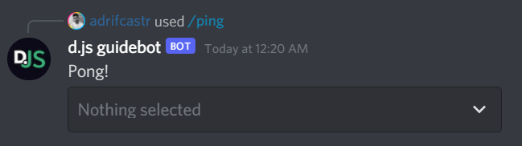

# Select menus

Select menus are one of the `MessageComponent` classes, which can be sent via messages or interaction responses.

::: tip
This page is a follow-up to the [slash commands](/slash-commands/advanced-creation.md) section and [action rows](/interactive-components/action-rows.md) page. Please carefully read those pages first so that you can understand the methods used here.
:::

## Building string select menus

The "standard" and most customizable type of select menu is the string select menu. To create a string select menu, use the <DocsLink section="builders" path="StringSelectMenuBuilder:Class"/> and <DocsLink section="builders" path="StringSelectMenuOptionBuilder:Class"/> classes.

If you're a Pokémon fan, you've probably made a selection pretty similar to this example at some point in your life!

```js {1,6-22}
const { StringSelectMenuBuilder, StringSelectMenuOptionBuilder, SlashCommandBuilder } = require('discord.js');

module.exports = {
	// data: new SlashCommandBuilder()...
	async execute(interaction) {
		const select = new StringSelectMenuBuilder()
			.setCustomId('starter')
			.setPlaceholder('Make a selection!')
			.addOptions(
				new StringSelectMenuOptionBuilder()
					.setLabel('Bulbasaur')
					.setDescription('The dual-type Grass/Poison Seed Pokémon.')
					.setValue('bulbasaur'),
				new StringSelectMenuOptionBuilder()
					.setLabel('Charmander')
					.setDescription('The Fire-type Lizard Pokémon.')
					.setValue('charmander'),
				new StringSelectMenuOptionBuilder()
					.setLabel('Squirtle')
					.setDescription('The Water-type Tiny Turtle Pokémon.')
					.setValue('squirtle'),
			);
	},
};
```

::: tip
The custom id is a developer-defined string of up to 100 characters. Use this field to ensure you can uniquely define all incoming interactions from your select menus!
:::

## Sending select menus

To send your select menu, create an action row and add the buttons as components. Then, send the row in the `components` property of <DocsLink path="InteractionReplyOptions:Interface" /> (extends <DocsLink path="BaseMessageOptions:Interface" />).

```js {1,24-25,29}
const {
	ActionRowBuilder,
	StringSelectMenuBuilder,
	StringSelectMenuOptionBuilder,
	SlashCommandBuilder,
} = require('discord.js');

module.exports = {
	// data: new SlashCommandBuilder()...
	async execute(interaction) {
		const select = new StringSelectMenuBuilder()
			.setCustomId('starter')
			.setPlaceholder('Make a selection!')
			.addOptions(
				new StringSelectMenuOptionBuilder()
					.setLabel('Bulbasaur')
					.setDescription('The dual-type Grass/Poison Seed Pokémon.')
					.setValue('bulbasaur'),
				new StringSelectMenuOptionBuilder()
					.setLabel('Charmander')
					.setDescription('The Fire-type Lizard Pokémon.')
					.setValue('charmander'),
				new StringSelectMenuOptionBuilder()
					.setLabel('Squirtle')
					.setDescription('The Water-type Tiny Turtle Pokémon.')
					.setValue('squirtle'),
			);

		const row = new ActionRowBuilder().addComponents(select);

		await interaction.reply({
			content: 'Choose your starter!',
			components: [row],
		});
	},
};
```

:::tip
Remember that if you have more than one select menu, each one will need its own action row.
:::

<!-- TODO: Update this section with a new image. Or make a component, idk
Restart your bot and then send the command to a channel your bot has access to. If all goes well, you should see something like this:

vue-discord-message doesn't yet have support for select menus
<DiscordMessages>
	<DiscordMessage profile="bot">
		<template #interactions>
			<DiscordInteraction profile="user" :command="true">ping</DiscordInteraction>
		</template>
		Pong!
	</DiscordMessage>
</DiscordMessages>


-->

### String select menu options

String select menu options are custom-defined by the user, as shown in the example above. At a minimum, each option must have it's `label` and `value` defined. The label is shown to the user, while the value is included in the interaction sent to the bot.

In addition to these, each option can be enhanced with a `description` or `emoji`, or can be set to be selected by default.

```js {4-9}
const select = new StringSelectMenuBuilder()
	.setCustomId('select')
	.addOptions(
		new StringSelectMenuOptionBuilder()
			.setLabel('Option')
			.setValue('option')
			.setDescription('A selectable option')
			.setEmoji('123456789012345678')
			.setDefault(true),
	);
```

## Auto-populating select menus

Although the String select menu with its user-defined options is the most customizable, there are four other types of select menu that auto-populate with their corresponding Discord entities, much like slash command options. These are:

- <DocsLink section="builders" path="UserSelectMenuBuilder:Class" />
- <DocsLink section="builders" path="RoleSelectMenuBuilder:Class" />
- <DocsLink section="builders" path="MentionableSelectMenuBuilder:Class" />
- <DocsLink section="builders" path="ChannelSelectMenuBuilder:Class" />

The `ChannelSelectMenuBuilder` can be configured to only show specific channel types using <DocsLink section="builders" path="ChannelSelectMenuBuilder:Class#setChannelTypes" type="method"/>.

## Multi-selects

Where slash command options fall behind is in their single-select limitation on User, Role and Channel option types. Select menus can support this use case via <DocsLink section="builders" path="BaseSelectMenuBuilder:Class#setMinValues" type="method"/> and <DocsLink section="builders" path="BaseSelectMenuBuilder:Class#setMaxValues" type="method"/>. When these values are set, users can select multiple items, and the interaction will be sent with all selected values only when the user clicks outside the select menu.

```js {7-8,13-14}
module.exports = {
	// data: new SlashCommandBuilder()...
	async execute(interaction) {
		const userSelect = new UserSelectMenuBuilder()
			.setCustomId('users')
			.setPlaceholder('Select multiple users.')
			.setMinValues(1)
			.setMaxValues(10);

		const row1 = new ActionRowBuilder().addComponents(userSelect);

		await interaction.reply({
			content: 'Select users:',
			components: [row1],
		});
	},
};
```
