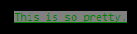

Some of the examples in this section are far from complete. We encourage you to look at the official documentation for all packages you are intending to use in your code. We just want to point out some we found useful in our endeavours of developing Discord apps for years and whet your appetite to try and test some of them in your own code base!

## Day.js

<Callout>Official documentation: [https://day.js.org/](https://day.js.org/en)</Callout>

Day.js is a powerful package that parses, validates, manipulates, and displays dates and times in JavaScript.
It allows you to quickly and easily format dates in any way you want or parse strings back into JavaScript Date objects.
There are many plugins for it that allow you to work with durations and more.

For example if you wanted to ask your users to give you a date,  
you can use Day.js to turn it into a Date object you can use in your code:

```js
const input = await interaction.channel.awaitMessages({
	filter: (m) => m.author.id === interaction.user.id,
	max: 1,
	time: 10e3,
	errors: ['time'],
});
const date = dayjs(input.first().content).toDate();
```

Using the [duration plugin](https://day.js.org/docs/en/durations/durations), you could tell the user if the date is in the future or the past:

```js
if (date.isValid()) {
	const now = dayjs();
	const duration = date - now;
	const formatted = dayjs.duration(duration, 'ms').format();

	if (duration > 0) {
		interaction.reply(`The date you gave me is ${formatted} into the future.`);
	} else {
		interaction.reply(`The date you gave me is ${formatted} into the past.`);
	}
} else {
	interaction.reply("You didn't give me a valid date.");
}
```

## ms

<Callout>Official documentation: [https://github.com/vercel/ms](https://github.com/vercel/ms)</Callout>

Ms is another tool for working with times in JavaScript. However, ms specializes on durations.
It allows you to convert times in milliseconds into human-readable formats and vice versa.

Example:

```js
await interaction.reply("Send two messages and I'll tell you how far apart you sent them.");
const messages = await interaction.channel.awaitMessages({
	filter: (m) => m.author.id === interaction.user.id,
	max: 2,
	time: 30e3,
	errors: ['time'],
});

const difference = messages.last().createdTimestamp - messages.first().createdTimestamp;
const formatted = ms(difference);

await interaction.followUp(`You sent the two messages ${formatted} apart.`);
```

## common-tags

<Callout>
	Official documentation: [https://github.com/zspecza/common-tags](https://github.com/zspecza/common-tags)
</Callout>

Common-tags is a library all about working with template literals.  
So far, you have probably only used them for interpolating variables into your strings, but they can do a whole lot more.
If you've got time, you should check out [the MDN's documentation about _tagged literals_.](https://developer.mozilla.org/docs/Web/JavaScript/Reference/Template_literals#Tagged_templates).

Ever got annoyed your multi-line strings had nasty bits of indentation in them,
but you did not want to remove the indentation in your source code?  
common-tags got you covered:

```js
const packageName = 'common-tags';

if (someCondition) {
	const poem = stripIndents`
		I like ${packageName}.
		It makes my strings so pretty,
		you should use it too.
	`;

	console.log(poem);
}
```

This will print your little poem like expected, but it will not have any tabs or other whitespace on the left.

But this is just the start! Another set of useful functions are the list-related functions:
`inlineLists`, `commaLists`, etc.  
With those, you can easily interpolate arrays into your strings without them looking ugly:

```js
const options = ['add', 'delete', 'edit'];

// -> Do you want me to add, delete or edit the channel?
interaction.reply(oneLineCommaListsOr`
	Do you want me to ${options} the channel?
`);
```

Check the the documentation to find more useful functions.

## chalk

<Callout>Official documentation: [https://www.npmjs.com/package/chalk](https://www.npmjs.com/package/chalk)</Callout>

Chalk is not exactly useful for Discord bots themselves, but it will make your terminal output a lot prettier and organized.
This package lets you color and style your `console.log`s in many different ways; No more simple white on black.

Let's say you want your error messages to be easily visible; Let us give them a nice red color:

```js
console.error(chalk.redBright('FATAL ERROR'), 'Something really bad happened!');
```


You can also chain multiple different multipliers.  
If you wanted to have green text, a grey background, and have it all underlined, that is possible:

```js
console.log(chalk.green.bgBrightBlack.underline('This is so pretty.'));
```



## pino

<Callout>Official documentation: [getpino.io](https://getpino.io)</Callout>

Pino is a Node.js logger with a very low overhead. But why does that even matter, if `console.log()` exists? Well, `console.log()` is quite slow and not very versatile. Whenever you make a call to `console.log()` your program halts and cannot do anything until the logging is finished.

To get started, install the package:

```sh tab="sh"
npm install pino
npm install -g pino-pretty
```

```sh tab="yarn"
yarn add pino
yarn global add pino-pretty
```

```sh tab="pnpm"
pnpm add pino
pnpm add --global pino-pretty
```

```sh tab="bun"
bun add pino
bun add --global pino-pretty
```

Pino is highly configurable, so we heavily recommend you take a look at their documentation yourself.

To use the same logger across the project you can put the following code into it's own file, for example `logger.js` and import it when needed:

```js
const pino = require('pino');
const logger = pino();
module.exports = logger;
```

```js
const { Client, Events, GatewayIntentBits } = require('discord.js');
const client = new Client({ intents: [GatewayIntentBits.Guilds] });
const logger = require('./logger');

client.once(Events.ClientReady, () => logger.info('The bot is online'));
client.on(Events.Debug, (info) => logger.debug(info));
client.on(Events.Warn, (info) => logger.warn(info));
client.on(Events.Error, (error) => logger.error(error));

client.login('your-token-goes-here');
```

Pino logs in a json format, so other programs and services like log aggregators can easily parse and work with the output. This is very useful for production systems, but quite tedious to read during development. This is why you installed `pino-pretty` earlier. Instead of formatting the log output itself the developers recommended that you [pipe](<https://en.wikipedia.org/wiki/Pipeline_(Unix)>) the log output to other services instead. `pino-pretty` is a formatter you can use for easy-to-read logs during development.

We recommend you set `pino-pretty` up in a package script in your `package.json` file, rather than typing the pipeline out every time. Please read our [guide section on package scripts](../improving-dev-environment/package-json-scripts), if you are not sure what we're talking about here.

```json
{
	"name": "my-bot",
	"version": "1.0.0",
	"description": "A Discord bot!",
	"main": "index.js",
	"scripts": {
		"test": "echo \"Error: no test specified\" && exit 1",
		"start": "node .",
		"lint": "eslint .",
		"dev": "node . | pino-pretty -i pid,hostname -t 'yyyy-mm-dd HH:MM:ss'" // [!code ++]
	},
	"keywords": [],
	"author": "",
	"license": "ISC"
}
```

<Callout type="warn">
	If you are using PowerShell, you have to use a package script for `pino-pretty`. PowerShell handles pipelines in a way
	that prevents logging. The command line interface is not affected.
</Callout>

In the example above, further arguments are passed to `pino-pretty` to modify the generated output. `-i pid,hostname` hides these two elements from logged lines and `-t yyyy-mm-dd HH:MM:ss` formats the timestamp into an easy to use format. Try out what works for you! The official [pino-pretty documentation](https://github.com/pinojs/pino-pretty) explains all possible arguments.

To start your bot with prettified input you run the `dev` script via your package manager of choice:

```sh tab="npm"
npm run dev
```

```sh tab="yarn"
yarn run dev
```

```sh tab="pnpm"
pnpm run dev
```

```sh tab="bun"
bun run dev
```

Pino is very flexible, supports custom log levels, worker threads and many more features. Please check out the [official documentation](https://getpino.io) if you want to up your pino game! Below we show an alternative for a production setup. Using this code, you will be logging the raw json objects into a file, instead of printing to your console:

```js
const pino = require('pino');
const transport = pino.transport({
	target: 'pino/file',
	options: { destination: './log.json' },
});
const logger = pino(transport);
module.exports = logger;
```

## i18next

<Callout>Official documentation: [https://www.i18next.com](https://www.i18next.com)</Callout>

i18next is an internationalization-framework for JavaScript. It is beneficial to translate your bot's user-facing messages into various languages based on the server it is used in.

Covering an entire use case example for internationalization would be out of this guide's scope and requires some more explanation as to how the system operates. Please refer to the official documentation linked above for an in-depth usage guide.
