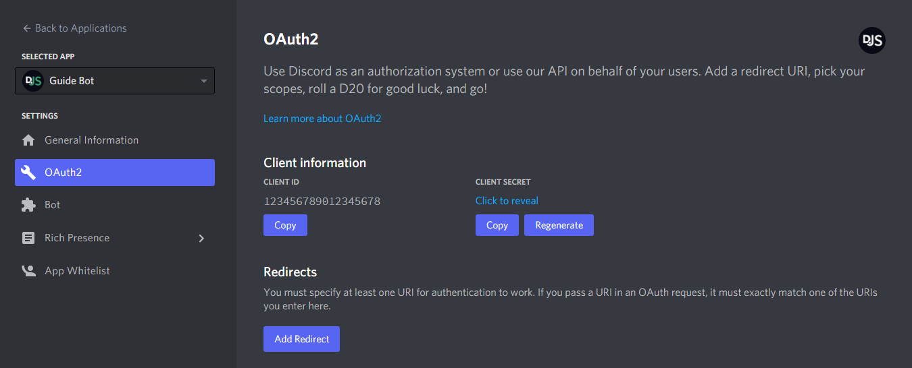

OAuth2 enables application developers to build applications that utilize authentication and data from the Discord API. Developers can use this to create things such as web dashboards to display user info, fetch linked third-party accounts like Twitch or Steam, access users' guild information without actually being in the guild, and much more. OAuth2 can significantly extend the functionality of your bot if used correctly.

## A quick example

### Setting up a basic web server

Most of the time, websites use OAuth2 to get information about their users from an external service. In this example, we will use [`express`](https://expressjs.com/) to create a web server to use a user's Discord information to greet them. Start by creating three files: `config.json`, `index.js`, and `index.html`.

`config.json` will be used to store the client ID, client secret, and server port.

```json title="config.json" lineNumbers
{
	"clientId": "",
	"clientSecret": "",
	"port": 53134
}
```

`index.js` will be used to start the server and handle requests. When someone visits the index page (`/`), an HTML file will be sent in response.

```js title="index.js" lineNumbers
const express = require('express');
const { port } = require('./config.json');

const app = express();

app.get('/', (request, response) => {
	return response.sendFile('index.html', { root: '.' });
});

app.listen(port, () => console.log(`App listening at http://localhost:${port}`));
```

`index.html` will be used to display the user interface and OAuth data once logged in.

```html title="index.html" lineNumbers
<!DOCTYPE html>
<html>
	<head>
		<title>My Discord OAuth2 App</title>
	</head>
	<body>
		<div id="info">Hoi!</div>
	</body>
</html>
```

After running `npm i express`, you can start your server with `node index.js`. Once started, connect to `http://localhost:53134`, and you should see "Hoi!".

<Callout>
	Although we're using express, there are many other alternatives to handle a web server, such as:
	[fastify](https://www.fastify.io/), [koa](https://koajs.com/), and the [native Node.js http
	module](https://nodejs.org/api/http.html).
</Callout>

### Getting an OAuth2 URL

Now that you have a web server up and running, it's time to get some information from Discord. Open [your Discord applications](https://discord.com/developers/applications/), create or select an application, and head over to the "OAuth2" page.



Take note of the `client id` and `client secret` fields. Copy these values into your `config.json` file; you'll need them later. For now, add a redirect URL to `http://localhost:53134` like so:


Once you've added your redirect URL, you will want to generate an OAuth2 URL. Lower down on the page, you can conveniently find an OAuth2 URL Generator provided by Discord. Use this to create a URL for yourself with the `identify` scope.


The `identify` scope will allow your application to get basic user information from Discord. You can find a list of all scopes [here](https://discord.com/developers/docs/topics/oauth2#shared-resources-oauth2-scopes).

### Implicit grant flow

<Callout type="error">
	Implicit grant flow, as previously covered in this section, is vulnerable to token leakage and replay attacks. Please
	use the **authorization grant** flow instead. You can find out more about the best implementation practices in the
	[Oauth2 RFC](https://datatracker.ietf.org/doc/html/rfc9700).
</Callout>

## More details

### The state parameter

OAuth2's protocols provide a `state` parameter, which Discord supports. This parameter helps prevent [CSRF](https://en.wikipedia.org/wiki/Cross-site_request_forgery) attacks and represents your application's state. The state should be generated per user and appended to the OAuth2 URL. For a basic example, you can use a randomly generated string encoded in Base64 as the state parameter.

```js
function generateRandomString() {
	let randomString = '';
	const randomNumber = Math.floor(Math.random() * 10);

	for (let i = 0; i < 20 + randomNumber; i++) {
		randomString += String.fromCharCode(33 + Math.floor(Math.random() * 94));
	}

	return randomString;
}

window.onload = () => {
	// ...
	if (!accessToken) {
		const randomString = generateRandomString();
		localStorage.setItem('oauth-state', randomString);

		document.getElementById('login').href += `&state=${btoa(randomString)}`;
		return (document.getElementById('login').style.display = 'block');
	}
};
```

When you visit a URL with a `state` parameter appended to it and then click `Authorize`, you'll notice that after being redirected, the URL will also have the `state` parameter appended, which you should then check against what was stored. You can modify the script in your `index.html` file to handle this.

```html title="index.html"
<script>
	// ... // [!code focus:15]
	const fragment = new URLSearchParams(window.location.hash.slice(1));
	const [accessToken, tokenType, state] = [
		fragment.get('access_token'),
		fragment.get('token_type'),
		fragment.get('state'),
	];

	if (!accessToken) {
		// ...
	}

	if (localStorage.getItem('oauth-state') !== atob(decodeURIComponent(state))) {
		return console.log('You may have been clickjacked!');
	}
</script>
```

<Callout type="error" title="Don't forgo security for a tiny bit of convenience!" />

### Authorization code grant flow

What you did in the quick example was go through the `implicit grant` flow, which passed the access token straight to the user's browser. This flow is great and simple, but you don't get to refresh the token without the user, and it is less secure than going through the `authorization code grant` flow. This flow involves receiving an access code, which your server then exchanges for an access token. Notice that this way, the access token never actually reaches the user throughout the process.

Unlike the [implicit grant flow](#implicit-grant-flow), you need an OAuth2 URL where the `response_type` is `code`. After you change the `response_type`, try visiting the link and authorizing your application. You should notice that instead of a hash, the redirect URL now has a single query parameter appended to it, i.e. `?code=ACCESS_CODE`. Modify your `index.js` file to access the parameter from the URL if it exists. In express, you can use the `request` parameter's `query` property.

```js
app.get('/', (request, response) => {
	console.log(`The access code is: ${request.query.code}`);
	return response.sendFile('index.html', { root: '.' });
});
```

Now you have to exchange this code with Discord for an access token. To do this, you need your `client_id` and `client_secret`. If you've forgotten these, head over to [your applications](https://discord.com/developers/applications) and get them. You can use [`undici`](https://www.npmjs.com/package/undici) to make requests to Discord.

To install undici, run the following command:

```sh tab="npm"
npm install undici
```

```sh tab="yarn"
yarn add undici
```

```sh tab="pnpm"
pnpm add undici
```

```sh tab="bun"
bun add undici
```

Require `undici` and make your request.

<Callout>
	If you are used to the Fetch API and want to use that instead of how `undici` does it, instead of using
	`undici#request`, use `undici#fetch` with the same parameters as node-fetch.
</Callout>

```js title="index.js"
const { request } = require('undici'); // [!code ++]
const express = require('express');
const { port } = require('./config.json'); // [!code --]
const { clientId, clientSecret, port } = require('./config.json'); // [!code ++]

const app = express();

app.get('/', async ({ query }, response) => {
	// [!code ++:28]
	const { code } = query;

	if (code) {
		try {
			const tokenResponseData = await request('https://discord.com/api/oauth2/token', {
				method: 'POST',
				body: new URLSearchParams({
					client_id: clientId,
					client_secret: clientSecret,
					code,
					grant_type: 'authorization_code',
					redirect_uri: `http://localhost:${port}`,
					scope: 'identify',
				}).toString(),
				headers: {
					'Content-Type': 'application/x-www-form-urlencoded',
				},
			});

			const oauthData = await tokenResponseData.body.json();
			console.log(oauthData);
		} catch (error) {
			// NOTE: An unauthorized token will not throw an error
			// tokenResponseData.statusCode will be 401
			console.error(error);
		}
	}

	return response.sendFile('index.html', { root: '.' });
});
```

<Callout>
	The content-type for the token URL must be `application/x-www-form-urlencoded`, which is why `URLSearchParams` is
	used.
</Callout>

Now try visiting your OAuth2 URL and authorizing your application. Once you're redirected, you should see an [access token response](https://discord.com/developers/docs/topics/oauth2#authorization-code-grant-access-token-response) in your console.

```json
{
	"access_token": "an access token",
	"token_type": "Bearer",
	"expires_in": 604800,
	"refresh_token": "a refresh token",
	"scope": "identify"
}
```

With an access token and a refresh token, you can once again use the [`/api/users/@me` endpoint](https://discord.com/developers/docs/resources/user#get-current-user) to fetch the [user object](https://discord.com/developers/docs/resources/user#user-object).

```js
const userResult = await request('https://discord.com/api/users/@me', {
	headers: {
		authorization: `${oauthData.token_type} ${oauthData.access_token}`,
	},
});

console.log(await userResult.body.json());
```

<Callout
	type="error"
	title="To maintain security, store the access token server-side but associate it with a session ID that you generate for the user."
/>

## Additional reading

[RFC 6759](https://tools.ietf.org/html/rfc6749)  
[Discord Docs for OAuth2](https://discord.com/developers/docs/topics/oauth2)
