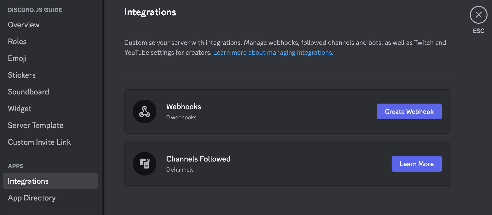
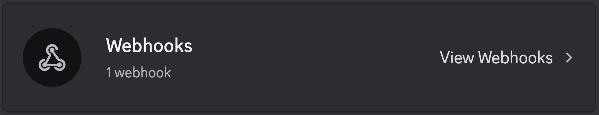
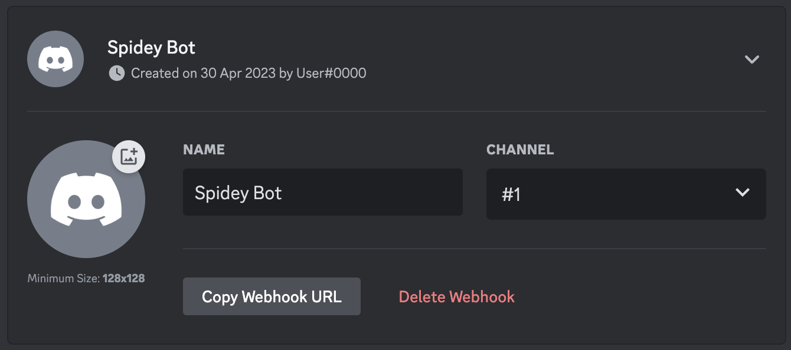

Webhooks can send messages to a text channel without having to log in as a bot. They can also fetch, edit, and delete their own messages. There are a variety of methods in discord.js to interact with webhooks. In this section, you will learn how to create, fetch, edit, and use webhooks.

## What is a webhook

Webhooks are a utility used to send messages to text channels without needing a Discord application. Webhooks are useful for allowing something to send messages without requiring a Discord application. You can also directly edit or delete messages you sent through the webhook. There are two structures to make use of this functionality: `Webhook` and `WebhookClient`. `WebhookClient` is an extended version of a `Webhook`, which allows you to send messages through it without needing a bot client.

<Callout>
	If you would like to read about using webhooks through the API without discord.js, you can read about them
	[here](https://discord.com/developers/docs/resources/webhook).
</Callout>

## Detecting webhook messages

Bots receive webhook messages in a text channel as usual. You can detect if a webhook sent the message by checking if the `Message.webhookId` is not `null`. In this example, we return if a webhook sent the message.

```js
if (message.webhookId) return;
```

If you would like to get the webhook object that sent the message, you can use `Message#fetchWebhook`.

## Fetching webhooks

<Callout>
	Webhook fetching will always make use of collections and Promises. If you do not understand either concept, revise
	them, and then come back to this section. You can read about collections [here](../additional-info/collections), and
	Promises [here](../additional-info/async-await) and
	[here](https://developer.mozilla.org/docs/Web/JavaScript/Guide/Using_promises).
</Callout>

### Fetching all webhooks of a guild

If you would like to get all webhooks of a guild you can use `Guild#fetchWebhooks`. This will return a Promise which will resolve into a Collection of `Webhook`s.

### Fetching webhooks of a channel

Webhooks belonging to a channel can be fetched using `TextChannel#fetchWebhooks`. This will return a Promise which will resolve into a Collection of `Webhook`s. A collection will be returned even if the channel contains a single webhook. If you are certain the channel contains a single webhook, you can use `Collection#first` on the Collection to get the webhook.

### Fetching a single webhook

#### Using client

You can fetch a specific webhook using its `id` with `Client#fetchWebhook`. You can obtain the webhook id by looking at its link, the number after `https://discord.com/api/webhooks/` is the `id`, and the part after that is the `token`.

#### Using the WebhookClient constructor

If you are not using a bot client, you can get a webhook by creating a new instance of `WebhookClient` and passing the `id` and `token` into the constructor. These credentials do not require you to have a bot application, but it also offers limited information instead of fetching it using an authorized client.

```js
//  [!code word:token\:]
const webhookClient = new WebhookClient({ id: 'id', token: 'token' }); // [!code word:id\:]
```

You can also pass in just a `url`:

```js
const webhookClient = new WebhookClient({ url: 'https://discord.com/api/webhooks/id/token' }); // [!code word:url\:]
```

## Creating webhooks

### Creating webhooks through server settings

You can create webhooks directly through the Discord client. Go to Server Settings, and you will see an `Integrations` tab.



If you already have created a webhook, the webhooks tab will look like this; you will need to click the `View Webhooks` button.



Once you are there, click on the `Create Webhook` / `New Webhook` button; this will create a webhook. From here, you can edit the channel, the name, and the avatar. Copy the link, the first part is the id, and the second is the token.



### Creating webhooks with discord.js

Webhooks can be created with the `TextChannel#createWebhook` method.

```js
channel
	// [!code word:createWebhook]
	.createWebhook({
		name: 'Some-username',
		avatar: 'https://i.imgur.com/AfFp7pu.png',
	})
	.then((webhook) => console.log(`Created webhook ${webhook}`))
	.catch(console.error);
```

## Editing webhooks

You can edit Webhooks and WebhookClients to change their name, avatar, and channel using `Webhook#edit`.

```js
webhook
	// [!code word:edit]
	.edit({
		name: 'Some-username',
		avatar: 'https://i.imgur.com/AfFp7pu.png',
		channel: '222197033908436994',
	})
	.then((webhook) => console.log(`Edited webhook ${webhook}`))
	.catch(console.error);
```

## Using webhooks

Webhooks can send messages to text channels, as well as fetch, edit, and delete their own. These methods are the same for both `Webhook` and `WebhookClient`.

### Sending messages

Webhooks, like bots, can send up to 10 embeds per message. They can also send attachments and normal content. The `Webhook#send` method is very similar to the method used for sending a message to a text channel. Webhooks can also choose how the username and avatar will appear when they send the message.

Example using a WebhookClient:

```js
const { EmbedBuilder, WebhookClient } = require('discord.js'); // [!code word:WebhookClient]
const { webhookId, webhookToken } = require('./config.json');

const webhookClient = new WebhookClient({ id: webhookId, token: webhookToken });

const embed = new EmbedBuilder().setTitle('Some Title').setColor(0x00ffff);

// [!code word:send]
webhookClient.send({
	content: 'Webhook test',
	username: 'some-username',
	avatarURL: 'https://i.imgur.com/AfFp7pu.png',
	embeds: [embed],
});
```

Try to find a webhook your bot knows the token for. This makes sure your bot can execute the webhook later on.

```js
const { Client, EmbedBuilder, Events, GatewayIntentBits } = require('discord.js');
const { token } = require('./config.json');

const client = new Client({ intents: [GatewayIntentBits.Guilds] });

const embed = new EmbedBuilder().setTitle('Some Title').setColor(0x00ffff);

client.once(Events.ClientReady, async () => {
	const channel = client.channels.cache.get('123456789012345678');
	try {
		const webhooks = await channel.fetchWebhooks();
		const webhook = webhooks.find((wh) => wh.token); // [!code word:wh.token]

		if (!webhook) {
			return console.log('No webhook was found that I can use!');
		}

		await webhook.send({
			content: 'Webhook test',
			username: 'some-username',
			avatarURL: 'https://i.imgur.com/AfFp7pu.png',
			embeds: [embed],
		});
	} catch (error) {
		console.error('Error trying to send a message: ', error);
	}
});

client.login(token);
```

### Fetching messages

You can use `Webhook#fetchMessage` to fetch messages previously sent by the Webhook.

```js
const message = await webhookClient.fetchMessage('123456789012345678'); // [!code word:fetchMessage]
```

### Editing messages

You can use `Webhook#editMessage` to edit messages previously sent by the Webhook.

```js
//[!code word:editMessage]
const message = await webhook.editMessage('123456789012345678', {
	content: 'Edited!',
	embeds: [embed],
});
```

### Deleting messages

You can use `Webhook#deleteMessage` to delete messages previously sent by the Webhook.

```js
await webhookClient.deleteMessage('123456789012345678'); // [!code word:deleteMessage]
```
