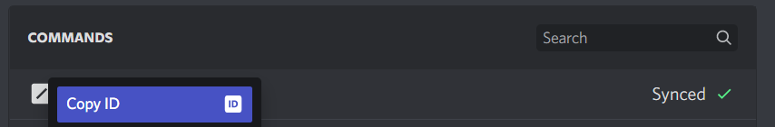

<Callout>
	This page is a follow-up to [command deployment](../app-creation/deploying-commands). To delete commands, you need to
	register them in the first place.
</Callout>

You may have decided that you don't need a command anymore and don't want your users to be confused when they encounter a removed command.

## Deleting specific commands

To delete a specific command, you will need its id. Head to **Server Settings -> Integrations -> Bots and Apps** and choose your bot. Then, right click a command and click **Copy ID**.

<Callout>
	You need to have [Developer Mode](https://support.discord.com/hc/articles/206346498) enabled for this to show up!
</Callout>




Edit your `deploy-commands.js` as shown below, or put it into its own file to clearly discern it from the deploy workflow:

```js title="deleteCommands.js"
const { REST, Routes } = require('discord.js');
const { clientId, guildId, token } = require('./config.json');

const rest = new REST().setToken(token);

// ...

// for guild-based commands
rest
	.delete(Routes.applicationGuildCommand(clientId, guildId, 'commandId'))
	.then(() => console.log('Successfully deleted guild command'))
	.catch(console.error);

// for global commands
rest
	.delete(Routes.applicationCommand(clientId, 'commandId'))
	.then(() => console.log('Successfully deleted application command'))
	.catch(console.error);
```

Where `'commandId'` is the id of the command you want to delete. Run your deploy script and it will delete the command.

## Deleting all commands

To delete all commands in the respective scope (one guild, all global commands) you can pass an empty array when setting commands.

```js title="deleteAllCommands"
const { REST, Routes } = require('discord.js');
const { clientId, guildId, token } = require('./config.json');

const rest = new REST().setToken(token);

// ...

// for guild-based commands
rest
	.put(Routes.applicationGuildCommands(clientId, guildId), { body: [] })
	.then(() => console.log('Successfully deleted all guild commands.'))
	.catch(console.error);

// for global commands
rest
	.put(Routes.applicationCommands(clientId), { body: [] })
	.then(() => console.log('Successfully deleted all application commands.'))
	.catch(console.error);
```

Discord's API doesn't currently provide an easy way to delete guild-based commands that occur on multiple guilds from all places at once. Each will need a call of the above endpoint, while specifying the respective guild and command id.

<Callout type="warn">
	Note, that the same command will have a **different id**, if deployed to a **different guild**!
</Callout>
