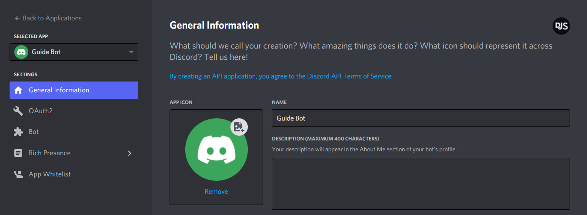
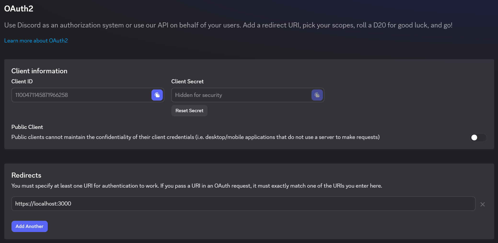

## Creating your RPC application

It's effortless to create one. The steps you need to take are as follows:

1. Open the [Discord developer portal](https://discord.com/developers/applications) and log into your account.
2. Click on the "New Application" button.
3. Enter a name and confirm the pop-up window by clicking the "Create" button.

You should see a page like this:

## Your app's client id and secret

After creating an app, you'll see a section like this under OAuth2:

Here you will need the client id and the secret, which you'll need to click "Reset Secret" to obtain. These are necessary for the authentication/authorization of your RPC client.

Setting the Redirects is also important so your app can redirect a user after authorizing your app if you request for any scopes from them. As shown in the image, the example redirect points to an RPC client running locally on port 3000.
